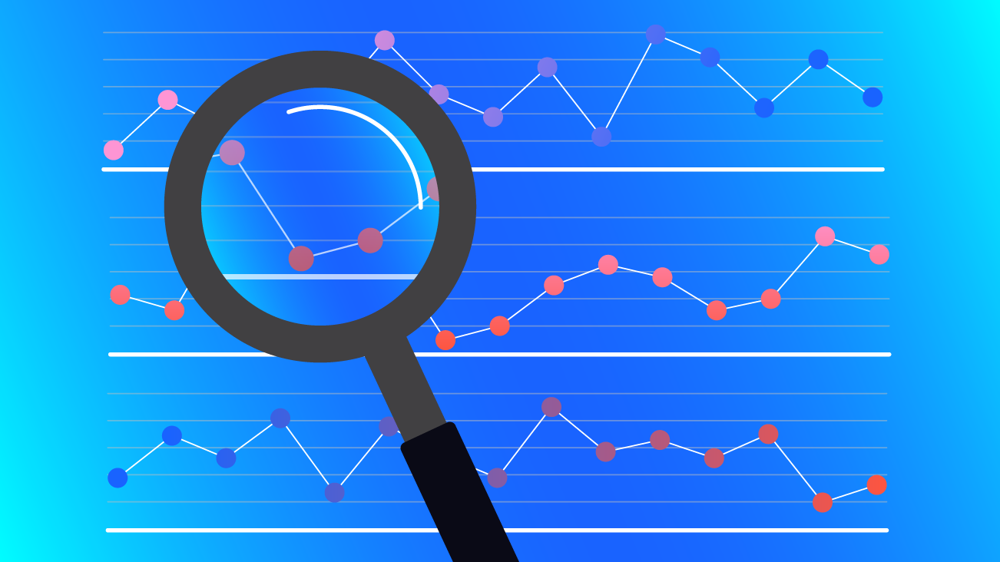

# Time Series Analysis and Forecasting

## Introduction

In the ever-evolving landscape of data science, the ability to understand and predict trends over time is a crucial skill. Time series analysis plays a pivotal role in unraveling patterns, identifying anomalies, and making informed predictions based on historical data. This Jupyter Notebook project delves into the realm of time series data, exploring various techniques for analysis and forecasting.

## Case Study

In this project, I analyze the monthly sales data of a medium-sized rental store business located in England.

Because rental activity varies from season to season due to proms, reunions, and other activities, business is expected to be seasonal. Financial manager would like to measure this seasonal effect, both to assist him in managing his
business and to use in negotiating a loan repayment
with his banker.

Even greater interest is finding a way of forecasting monthly sales. As business continues to grow, it requires more capital and long-term debt. 

## Models and Concepts
- Seasonal Decomposition
- Exponential Smoothing Holt-Winters
- Augmented Dickey–Fuller test
- SARIMA
- Metrics and measure: RMSE (Root Mean Squared Error), AIC. 
 
## Language/Libraries
* Python / Jupyter notebooks
* Statsmodels
* Scipy
* Sklearn.metrics
* Pandas
* Numpy
* Matplotlib
* Seaborn

## Dataset

This dataset spans 8 years and captures monthly sales records of a medium-sized rental store business.

